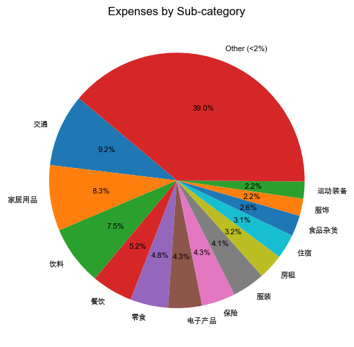
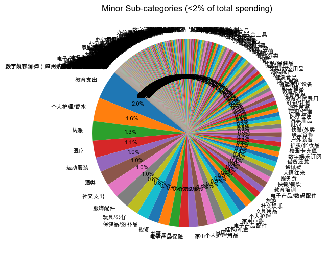
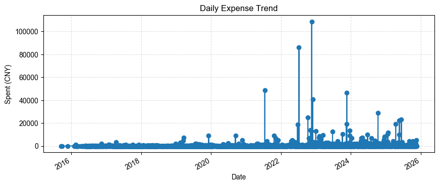

# 分析摘要

- 总收入：223,250.70 CNY
- 总支出：1,457,781.32 CNY
- 净收入：-1,234,530.62 CNY
- 最大支出类目：shopping（351,140.96 CNY）
- 支出最高日：2022-11-17（108,748.14 CNY）
- 投资收入总额：1,441,723.73 CNY（最大子类：投资）

## 可视化图表

### 子类支出分布
饼图展示本次分析中各子类支出所占比例，剔除低于2%的细分类以保持可读性。

### 低比例子类对比（<2%）
饼图突出展示占总支出比例低于2%的子类，百分比表示其相对于整体支出的占比，方便对比。

### 日度支出趋势
折线图展示分析期间每日的累计支出变化。

## 主要支出明细
1. 苹果官网产品 — 12,999.00 CNY，2023-12-19，付款方式：工商银行储蓄卡(4310)
2. 2023年秋季,博士生学费--学生处  — 10,000.00 CNY，2023-10-04，付款方式：工商银行储蓄卡(4310)
3. 浙江大学医学院附属口腔医院门诊缴费 — 9,514.00 CNY，2023-03-13，付款方式：工商银行储蓄卡(4310)
4. 哈尔滨工业大学微信缴费 — 9,200.00 CNY，2019-12-06，付款方式：工商银行储蓄卡(3204)
5. 哈尔滨工业大学微信缴费 — 9,200.00 CNY，2020-09-11，付款方式：建设银行储蓄卡(4168)
6. 交2024年个人养老金 — 7,000.00 CNY，2024-12-16，付款方式：余额宝
7. 考满分课程 — 5,487.90 CNY，2019-03-18，付款方式：余额
8. 支付宝小荷包-五一去哈尔滨玩 — 5,000.00 CNY，2024-04-17，付款方式：余额宝
9. 小米科技5241219175104331号订单 — 4,498.00 CNY，2024-12-19，付款方式：招商银行信用卡(4096)
10. 商品 — 4,470.00 CNY，2025-11-15，付款方式：工商银行信用卡(3389)&红包