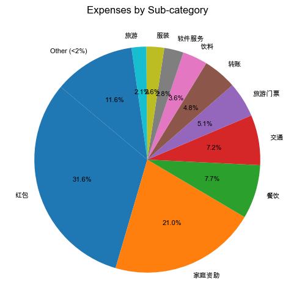
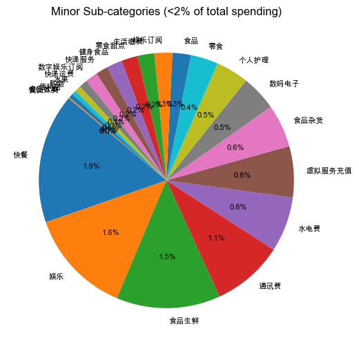
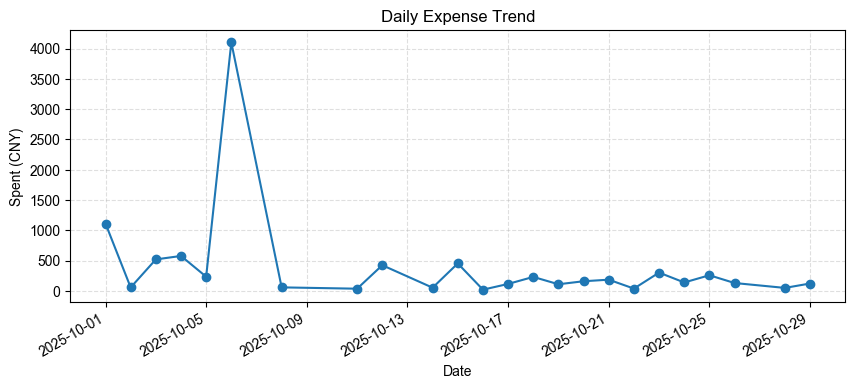

# 分析摘要

- 总收入：1,001.80 CNY
- 总支出：9,501.69 CNY
- 净收入：-8,499.89 CNY
- 最大支出类目：red_packet（5,545.10 CNY）
- 支出最高日：2025-10-06（4,101.80 CNY）
- 投资收入总额：40,605.41 CNY（最大子类：投资）

## 可视化图表

### 子类支出分布
饼图展示本次分析中各子类支出所占比例，剔除低于2%的细分类以保持可读性。

### 低比例子类对比（<2%）
饼图突出展示占总支出比例低于2%的子类，百分比表示其相对于整体支出的占比，方便对比。

### 日度支出趋势
折线图展示分析期间每日的累计支出变化。

## 主要支出明细
1. 感谢老妈 — 2,000.00 CNY，2025-10-06，付款方式：余额宝
2. 感谢老爸 — 2,000.00 CNY，2025-10-06，付款方式：余额宝
3. 欢迎宝来陕西！ — 1,000.00 CNY，2025-10-01，付款方式：余额宝
4. 转账备注:微信转账 — 358.00 CNY，2025-10-15，付款方式：零钱通
5. 百度网盘超级会员(1年-自动续费) — 263.00 CNY，2025-10-23，付款方式：余额宝
6. 西安碑林博物馆旅游服务部 — 260.00 CNY，2025-10-04，付款方式：零钱通
7. 【3件包】爱慕先生内裤男80S莫代尔抗菌净痕腿围加大码装腰平角裤 — 243.00 CNY，2025-10-12，付款方式：工商银行信用卡(3389)
8. 西安博阅通文化旅游有限公司 — 200.00 CNY，2025-10-03，付款方式：工商银行信用卡(3389)
9. 碑林博物馆 — 170.00 CNY，2025-10-03，付款方式：零钱通
10. 火车票 — 160.00 CNY，2025-10-20，付款方式：工商银行信用卡(3389)